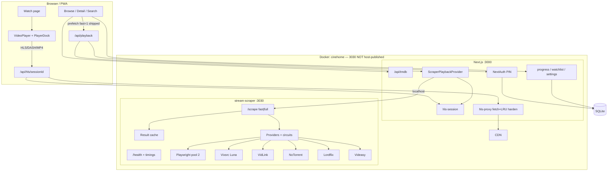
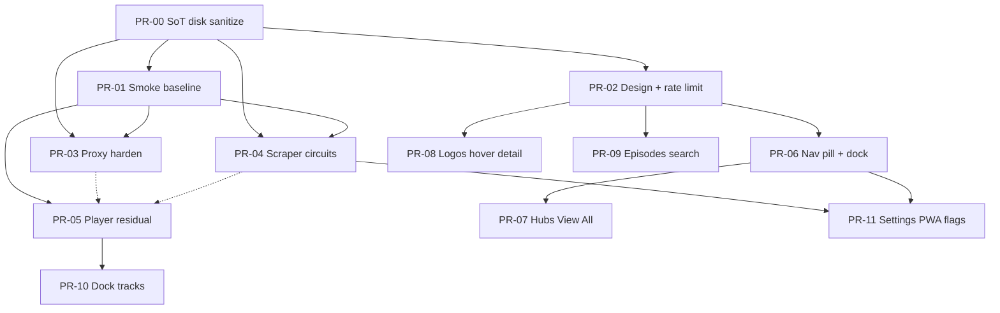

# CineHome Full Overhaul Design Document

| Field | Value |
|-------|-------|
| **Title** | CineHome Full Overhaul — LordFlix-inspired UX + Playback Reliability |
| **Author** | design-doc-writer (CineHome Overhaul) |
| **Date** | 2026-07-09 |
| **Status** | **Ready for Implementation** (rev 4 — user decisions locked) |
| **Primary source of truth** | `/home/hussy/cinehome` on hussyserver (`100.89.184.84`) — *after tree sanitization* |
| **Live deploy** | `http://100.89.184.84:4445` |
| **Inspiration** | [LordFlix](https://lordflix.org) (UX/UI patterns only; CineHome brand retained) |
| **Baseline as-of** | 2026-07-09 (SSH + live container verification) |

---

## Overview

CineHome is a household self-hosted Netflix-style app: TMDB catalog browse → multi-provider stream resolution → custom player (hls.js + dash.js) through a session-aware HLS proxy. Production runs on an Ubuntu laptop server in a **single Docker container** (`cinehome`, host `4445→3000`, scraper on `3030` **internal only**).

This document defines a **full product overhaul**, calibrated to the **actual server baseline** (not a greenfield rewrite). Large parts of progressive playback, Luna-first resolve, detail prefetch, player dock, and HLS fetch+LRU **already ship**. The overhaul focuses on:

1. **Ops hygiene** — clean SoT git, tree sanitization, Docker disk reclaim, early smoke metrics  
2. **Residual reliability** — Luna-miss UX, circuits, failover, season rollover, proxy byte-cap/metrics  
3. **LordFlix-quality UI/IA** — design tokens, hubs, nav, logos, detail density, search, mobile dock  
4. **Player polish** — hide empty dock sections, real track selection gaps, gear wiring  

**Phase sequencing (rev 4, user-confirmed):** After SoT + smoke baseline (**PR-00/01**), prefer the **UI-first release train** (KD19). Reliability residual may run **in parallel**, but the first user-visible release prioritizes design/IA/chrome; playback hardening is not a rewrite and must not block UI merge/deploy.

---

## Baseline Inventory (shipped vs gap)

*Verified 2026-07-09 against `/home/hussy/cinehome` and container. Implementers must treat “shipped” as do-not-rebuild.*

| Feature | Status | Evidence / files | Overhaul action |
|---------|--------|------------------|-----------------|
| Next.js 16 + Bun + Prisma SQLite | **Shipped** | `package.json`, `schema.prisma` | Keep |
| Single container `start.sh` | **Shipped** | `Dockerfile`, `docker-compose.yml`, `DECISIONS.md` | Keep; never publish 3030 |
| Auth on `/api/playback` | **Shipped** | `getAuthenticatedUserId` → 401 | Keep (KD3) |
| HLS session + SSRF allowlist | **Shipped** | `hls-session.ts`, `api/hls`, `isAllowedUpstreamUrl` | Harden only |
| HLS proxy **fetch + entry LRU** | **Shipped** | `hls-proxy.ts` 387 LOC: `SEGMENT_CACHE_MAX=2000`, TTL 2h, native `fetch`, `prefetchSegments` (first 3) | **Harden**: byte-cap, metrics, optional keep-alive Agent — *not rewrite* |
| curl for discovery only | **Shipped** | scraper `curl-http` / `vidlink-api` | Keep (fingerprint path) |
| Luna-first + `fast=1` early return | **Shipped** | scraper `resolveVixsrcFast`, `scheduleBackgroundEnrich` | Residual: Luna-miss UX |
| Background enrich / min sources | **Shipped** | `MIN_SOURCES_TARGET=5`, Playwright if needed | Circuits for enc-dec |
| Cache TTL 3m HLS / 15m general | **Shipped** | scraper constants | Document; align with session |
| `useWatchPlayback` dual-query merge | **Shipped** | `use-playback.ts`: `POLL_INTERVAL_MS=12000`, max 8 refetches, merge-by-id | Residual: empty fast error messaging |
| `usePrefetchPlayback` on detail | **Shipped** | `movie-detail.tsx` imports/calls it | Keep; don’t re-add |
| `pickDefaultSource` / Luna prefs | **Shipped** | `source-quality.ts`, `player-preferences.ts` | Optional `codec` field later |
| Multi-source player + dash.js | **Shipped** | `video-player.tsx` | Polish |
| LordFlix-style right dock | **Partial** | `player-dock.tsx` ~429 LOC; shows empty sub/audio placeholders | Hide empty; wire gear |
| Failover scaffolding | **Partial** | `failedSourceIds`, pick next; UX still “try settings” | Auto-failover + Retry full |
| Discovering-sources UI | **Partial** | `isEnriching` / `isDiscoveringSources` → dock loading slots (`watch.tsx`, `player-dock.tsx`) | Soft-miss copy when fast returns empty error while full pending; avoid hard-error flash |
| Next episode | **Partial** | `episode + 1` only | Season-boundary rollover |
| Subtitles / audio tracks | **Partial** | Dock placeholders; hls.js paths present; not hide-empty | Inventory live titles; fix gaps |
| Design System v3 Parts A–C | **Missing / partial** | `plan.md` still “planning only”; `motion.ts` has `EASE_OUT_EXPO` (A2 partial) | Ship Part A–C |
| Movies/Shows hubs / View All | **Missing** | Nav: Home, Watchlist, Continue only | New IA |
| Floating pill nav / mobile dock | **Missing** | Hamburger mobile | New |
| Title logos in hero/detail UI | **Partial** | `pickTitleLogoUrl` in `tmdb.ts`; not fully rendered everywhere | Wire UI |
| Git SoT | **Missing** | no `.git` on server or local app | PR-00 |
| Tree hygiene | **Dirty** | root orphan providers, dual `app/` vs `src/app/` (divergent; only `src/app` has system-status), `.bak` | **Canonical = `src/app`**; delete root `app/` after build/health |

| Docker disk budget | **Unmanaged** | ~77GB reclaimable build cache; volume 75% full | PR-00 prune |
| Smoke metrics harness | **Missing** | Manual curl only | PR-01 early |
| Login rate limit | **Missing** | — | Early with PR-02 |

### Claims verification matrix (as-of 2026-07-09)

| Claim | Verdict |
|-------|---------|
| Path `/home/hussy/cinehome`, live `:4445` | **True** |
| Disk ~75% / ~30Gi RAM | **True** |
| curl-per-segment still primary | **False** — fetch+entry LRU shipped |
| Segment LRU “under-specified” | **Partial** — entry LRU exists; byte-cap + metrics missing |
| Progressive / Luna / detail prefetch greenfield | **False** — largely shipped |
| Git SoT exists | **False** |
| plan.md fully implemented | **False** — planning only header; A2 partial |
| Lordflix/Videasy often 0 streams | **Plausible** (enc-dec dependency) |
| Gear no-op | **Likely true** (STATUS 2026-07-08; re-verify in player PR) |

---

## Background & Motivation

### Current state

| Layer | Status |
|-------|--------|
| Stack | Next.js 16 + Bun + Prisma SQLite + Playwright stream-scraper |
| Scraper | Health OK; `MAX_BROWSERS = 2`; Luna-first; fast + background enrich |
| HLS proxy | **fetch + 2000-entry LRU + segment prefetch** (not curl-per-segment) |
| Player | Multi-source + dock (partial polish) |
| Auth | Playback requires session |
| Design | `plan.md` Parts A–C planned; incomplete in product |
| Repo | **No git**; dirty root; multi-copy drift (`cinehome-app`, patches) |
| Host | 75% disk; **~76GB reclaimable Docker build cache**; co-resident containers (qbittorrent, n8n, etc.) |

### Pain points (prioritized)

1. **No clean git SoT** + dirty tree risks shipping orphans/secrets  
2. **Docker disk pressure** — rebuilds without prune threaten free space (~234G free but 77GB reclaimable waste)  
3. **No baseline smoke metrics** — latency targets are aspirational until measured  
4. **UX gap vs LordFlix** — hubs, nav shell, logos, hover, search empty, episode cards  
5. **Flaky providers** — residual client UX (Luna miss, failover, Retry) incomplete  
6. **Player chrome incomplete** — empty dock sections, gear, season next-ep  
7. **Co-tenant host load** — scrape + dual stream competes with other containers  

### What CineHome already does better (keep)

- Browse row depth; continue watching; family PIN auth; multi-source player depth  
- Progressive fast/full hooks; detail prefetch; HLS session proxy; speed/PiP/keyboard  

### Research inputs

- Server `plan.md`, `DECISIONS.md`, `CINEHOME.md`, handoffs STATUS/audit  
- `cinehome-patches/research-*` (**stale on curl-per-segment** — prefer server code)  
- UI research under `~/.claude/jobs/73826bb3/tmp/ui_research/`  
- Design review 2026-07-09 (this revision)

---

## Goals & Non-Goals

### Goals

1. **Ops baseline** — sanitized tree, private git, disk prune policy, early smoke harness  
2. **IA & navigation** — Movies/Shows hubs, View All, desktop floating pill, mobile bottom dock  
3. **Visual design system** — complete Part A–B tokens/motion; Part C polish  
4. **Home / browse UX** — logos, card hover, View All rows  
5. **Detail / search / TV episodes** — density, empty search hero, horizontal episodes  
6. **Player residual reliability** — Luna-miss UX, auto-failover, Retry full, season rollover, gear  
7. **Proxy/scraper hardening** — byte-cap LRU, metrics, provider circuits (not rewrite of shipped paths)  
8. **Subtitles & audio** — hide empty sections; fix proxy/track gaps after live inventory  
9. **Personalization / settings** — polish; surface health  
10. **PWA mobile** — bottom dock + safe-area + SW API rules  
11. **Security** — per-username rate limits early; 3030 never published; optional Tailscale bind  
12. **Performance** — measure baseline first; gate on deltas  

### Non-goals

| Non-goal | Rationale |
|----------|-----------|
| Public multi-tenant SaaS | Household product |
| Hosted media / torrent client | Resolve-only streams |
| Pixel-perfect LordFlix / ads | Inspiration only |
| YouTube iframe main playback | Custom player remains |
| Rebuilding progressive playback / proxy from scratch | Already shipped |
| Godot rules | Unrelated |
| Split scraper container by default | KD2 |

---

## Key Decisions

| # | Decision | Rationale |
|---|----------|-----------|
| **KD1** | **Sanitized server tree** is sole production SoT; private git remote after cleanup — never `git add .` on dirty host | Prevents orphans/secrets as SHA0 |
| **KD2** | **Single Docker container** (`start.sh`) | Matches `DECISIONS.md`; localhost:3030 |
| **KD3** | **Auth required** for playback, progress, watchlist | Bandwidth + multi-user isolation |
| **KD4** | **Luna-first progressive path stays** — overhaul only residual UX/API flags | Shipped; do not rebuild |
| **KD5** | **API/HTTP first; Playwright last resort** when `sources < MIN_SOURCES_TARGET` | Existing scraper policy |
| **KD6** | **Harden HLS proxy** (byte-cap LRU, hit/miss metrics, optional keep-alive Agent, live `#EXT-X-MEDIA` verification) — **do not replace** fetch+entry LRU | Curl-per-segment already gone on server |
| **KD7** | LordFlix **patterns**, CineHome **brand** | Identity + legal |
| **KD8** | **Fixed category taxonomy** for hubs/View All (see Appendix C) | Unblocks PR-07 without open Q |
| **KD9** | **Mobile bottom dock** primary; desktop floating pill; **Continue not in primary nav** (home row + `/continue` only) | LordFlix-like IA; keep continue feature without nav clutter |
| **KD10** | **Hide empty SUBTITLES/AUDIO** dock sections | Cleaner than placeholders |
| **KD11** | Scrape cache TTLs stay; **align segment cache keying with session validity** (evict or tag by session; don’t serve 2h segments after session death) | Stale segment risk |
| **KD12** | **Disk budget first-class**: free-space floor **20GB** before build; keep last **2** cinehome images; prune build cache post-build; segment cache **byte-cap 512MB** + entry max 2000; Playwright browsers **≤2** (current) unless smoke proves need | Real host pressure is Docker cache, not 512MB alone |
| **KD13** | No YouTube iframe for main playback; trailer thumb + outbound | Existing DECISIONS |
| **KD14** | Detail prefetch **stays** as-is (`usePrefetchPlayback`) | Already wired |
| **KD15** | **~12 PRs**, dual trains after M0: **UI train preferred first** (design→IA→polish); reliability train (proxy→scraper→player residual) parallel but not blocking first release | User 2026-07-09: UI-first; plan.md order within UI train |
| **KD16** | **Keep light/dark/system theme** (already implemented) | Do not remove light theme |
| **KD17** | **Private GitHub repository** is the sole SoT remote (not Gitea, not local-only git) | User confirmed 2026-07-09 |
| **KD18** | **Trusted-network no-auth: rejected for default** | Guests get PIN profiles; no open scrape |
| **KD19** | **UI-first after PR-00/01** — first release train is design/IA/chrome; reliability residual parallel, not a gate | User confirmed 2026-07-09; playback already playable |
| **KD20** | **CTA matrix**: Hero/detail primary Play = **light/white pill** (LordFlix parity); in-app secondary actions use **crimson primary** / icon circles; card hover = **white circular play** | Component-level consistency |
| **KD21** | Rate limit login by **username + attempt count**, not household IP alone | Single NAT would lock whole family |
| **KD22** | **OpenSubtitles / external subtitle providers are out of MVP** — manifest/provider tracks only | User confirmed 2026-07-09 (OQ1) |

### User decisions (2026-07-09)

Locked by product owner; supersede any softer wording elsewhere in this doc:

| Decision | Lock |
|----------|------|
| **Git remote** | Private **GitHub** only (KD17). Not Gitea. Not local-only unhosted git. Exact org/repo name still chosen at PR-00. |
| **Release train order** | **UI-first** after PR-00/01 (KD19). Reliability residual may run parallel; first household release prioritizes LordFlix-quality chrome/IA. |
| **OpenSubtitles** | **Out of MVP** (KD22). No external subtitle API. Subtitles only from HLS/DASH/provider manifests when present; hide empty dock sections (KD10). |

---

## Proposed Design

### 1. System architecture



### 2. Information architecture & navigation

#### Route map

| Route | Purpose | Status |
|-------|---------|--------|
| `/` | Home — hero + mixed rows + continue | Enhance |
| `/movies` | Movies hub | **New** |
| `/shows` | Shows hub | **New** |
| `/browse/[category]` | View All grid | **New** — slugs in Appendix C |
| `/search` | Search + empty hero | Enhance |
| `/movie/[id]`, `/tv/[id]`, `/tv/[id]/season/[n]` | Detail / season | Enhance |
| `/watch/[type]/[id]` | Player (immersive; **no bottom dock**) | Polish residual |
| `/watchlist` | My List | Label in nav |
| `/continue` | Continue watching | Keep; **not** primary nav item |
| `/settings`, `/login` | Family / admin / PIN | Polish |

#### Nav item matrix

| Item | Desktop pill | Mobile dock | Watch route |
|------|--------------|-------------|-------------|
| Home | yes | yes | hidden (back only) |
| Movies | yes | yes | no |
| Shows | yes | yes | no |
| My List | yes | yes | no |
| Search | icon/field right | yes (5th) | no |
| Continue | **no** (home row only) | no | no |
| Settings | avatar menu | avatar overflow | no |
| Install PWA | avatar/menu if available | overflow | no |

#### Desktop floating pill

- Centered or left-cluster pill: `Home · Movies · Shows · My List`  
- Right: search (compact), avatar (settings / install / sign out)  
- Scroll: stronger blur (`bg-background/70 backdrop-blur-xl`)  
- z-index: `z-50` header; dock `z-50`; modals above  
- Before hubs land: Movies/Shows may link to `/search?type=movie` / `type=tv` **placeholders** so mobile dock need not wait on full hub pages  

#### Mobile bottom dock

- 5 slots: Home, Movies, Shows, My List, Search  
- `pb-[env(safe-area-inset-bottom)]`; layout `pb-20 md:pb-0` on `(main)/layout.tsx`  
- Hidden on `/watch/*`  
- Replaces hamburger as primary  

### 3. Visual design system

Complete server `plan.md` Parts A–B; Part C items land in UI PRs.

#### Tokens (summary)

| Domain | Spec |
|--------|------|
| Background | Near-black theatre (`oklch(0.045…)` ≈ `#050505`) |
| Primary | Crimson accent (secondary CTAs, rings) |
| Play CTA | **White/light pill** on hero/detail (KD20); crimson elsewhere |
| Type | Inter + Montserrat `font-display` |
| Motion | `EASE_OUT_EXPO`, `DURATION_*` in `motion.ts`; **never omit ease** |
| Radius | full pills; 2xl panels; xl posters; lg inner only |
| Spacing | Wide pages `mt-10`–`mt-12`; narrow forms `space-y-6` |

#### Part A checklist (must land in design PR)

| ID | Fix | Files |
|----|-----|-------|
| A1–A2 | Shared ease on bare transitions | motion + detail/search/watchlist/continue/tv-season |
| A3 | Remove local LoadingSkeleton | `movie-detail.tsx` |
| A4 | watchlist-button `rounded-full` | `watchlist-button.tsx` |
| A5 | Settings family row `rounded-2xl` | `settings.tsx` |
| A6 | font-display alternate states | continue, watchlist, settings, watch |

#### plan.md sequencing reconciliation (Issue 18)

Within the **UI train**, adopt research order after foundation:

1. Part A/B foundation  
2. C1 logos → C3 detail density → C2 card hover  
3. C6 mobile nav (with desktop pill; placeholders OK)  
4. Hubs/View All (product addition beyond plan.md — after or with nav)  
5. C5 search empty → C4 episodes  

**Why not block UI on playback rewrite:** progressive/proxy already ship (KD19). Reliability train runs parallel for residual flaky-source UX.

### 4. Home / browse UX

- Hero: logo artwork, meta chips, synopsis clamp, white pill Play, circular +  
- Rows: View All → `/browse/[category]` (Appendix C)  
- Continue row first when signed in  
- Poster hover: centered white play + top-right watchlist  
- Backdrop/continue wide cards: keep bottom meta  

**BrowseHub** (extract from `home.tsx`):

```ts
// Conceptual props — client view pattern matches existing HomeView
interface BrowseHubProps {
  mediaType: "movie" | "tv";
  title: string;
  heroFrom: "trending" | "popular"; // first row source for hero items
  rows: Array<{
    id: string;           // category slug for View All (Appendix C)
    title: string;
    /** Path *after* `/api/tmdb/` as consumed by `src/app/api/tmdb/[...path]/route.ts`
     *  (NOT raw TMDB query strings). Examples from home.tsx:
     *    "trending/movie/week"
     *    "movie/popular/1"
     *    "discover/movie/28"          // genre id is path segment
     *    "discover/movie/28?page=2"   // page via query only
     */
    tmdbPath: string;
  }>;
}
```

- Data: same as home — `useQuery` + `fetch(\`/api/tmdb/\${tmdbPath}\`)` (auth required today)  
- **Only use paths in the live proxy allowlist** (Appendix C). Missing TV list endpoints ship in PR-07 precondition.  
- Loading: existing row/hero skeletons  
- Empty/error: `empty-states.tsx` pattern  

### 5. Detail pages

| Element | Spec |
|---------|------|
| Logo | `max-h-24 sm:max-h-32 w-auto object-contain` |
| CTAs | White pill Play, circular +, trailer card |
| Meta / Read more / Ends at | As plan.md C3 |
| Info panel | Movie: language, budget, revenue; TV: seasons/episodes/status |
| Cast | Circular avatars |
| Prefetch | **Already shipped** — do not reimplement |
| Recs | “You Might Also Like” |

#### TV episodes

- Horizontal cards: still **160×90** (sm) / **200×112** (md), `rounded-xl`, E# badge top-left, duration bottom-right, title 1-line clamp  
- Skeleton: 6 horizontal pulse cards  
- Focus: keyboard focus ring on card; click → watch  
- Sort: Oldest / Newest; season dropdown  

### 6. Search

| Item | Spec |
|------|------|
| Empty hero | “What would you like to watch?” + oversized pill input |
| Recents | `localStorage` key `cinehome:search-recent`; **max 8**; **per-browser** (not per-profile MVP); clear chip “Clear recent” |
| Filters | `type=all\|movie\|tv`, genre via existing pills |
| Results | Dense grid unchanged |

### 7. Watch / player — residual only

```
States for progressive resolve (client):

  resolving_fast     → spinner + “Finding a stream…”
  available          → play; dock may show isDiscoveringSources
  fast_empty         → keep spinner if full still loading; copy:
                       “Still searching for servers…”
                       (scraper may return error: "No Luna source yet — try again shortly."
                        with sources:[]; treat as soft-miss, NOT hard error if full pending)
  available_enriching→ playing + dock loading dots
  all_failed         → error panel + [Retry] (nocache full) + [Back]
  unauthorized       → prompt login
```

| Residual gap | Spec |
|--------------|------|
| Luna miss | Soft-miss UX above; do not flash hard error while `full` pending. Dock **discovering** slots already partial-shipped (`isDiscoveringSources`) — residual is **copy/state** when fast returns empty/`error` with full still in flight |
| Auto-failover | On fatal media error → next ranked source; mark failed; no “open settings” requirement |
| Retry | `nocache=1` full resolve; reset failed set |
| Next episode | Season boundary: if last ep, go to S+1 E1 when exists |
| Gear | Opens dock / expands quality — must not no-op |
| Speed | Dock PLAYBACK section |
| Hide empty sub/audio | KD10 |

### 8. Playback reliability (hardening + residual)

#### 8.1 Verification bar (definition)

A source is **verified** when scraper (existing `verifyHlsServer` path) achieves:

1. Upstream master (or media) playlist **HTTP 200** within timeout, **and**  
2. Body parses as M3U with at least one segment or variant line, **or** first media segment probe **> 500 bytes** (existing vidlink-style probe)

Playability for product metrics (smoke): browser/player **`playing` event or first frame** within timeout — **not** merely scrape JSON with URL.

#### 8.2 Scrape / API contract (compat)

Existing: `GET /scrape?tmdbId&mediaType&season&episode&fast=1&nocache=1`  
App: `GET /api/playback/[type]/[id]?season&episode&fast=1&nocache=1` (auth)

**Additive fields only** (backwards compatible; no external callers assumed):

```ts
// ScrapeResult / PlaybackResponse extensions
partial?: boolean;  // true when background enrich may still add sources
// Optional debug (admin / smoke only; strip from prod client if noisy):
providerTimings?: Record<string, number>;

// PlaybackSource optional:
codec?: "h264" | "hevc" | "unknown";
```

**Client constants (shipped — document, don’t invent):**

| Constant | Value | File |
|----------|-------|------|
| Fast timeout | 25s | `use-playback.ts` |
| Full timeout | 120s | `use-playback.ts` |
| `POLL_INTERVAL_MS` | 12_000 | full query refetch interval |
| Max extra full refetches | 8 | stop when sources ≥ 5 or cap |
| Full watch query | `nocache=1` today | ensures enrich; keep unless merge bugs |

Set `partial: true` on fast responses when background enrich scheduled; client may use for dock “discovering” even before full returns.

#### 8.3 Circuit breaker thresholds

In-memory per provider (reset on process restart — acceptable for household):

| Param | Value |
|-------|-------|
| Window | last 20 attempts or 10 minutes |
| Open when | error rate ≥ 50% **and** ≥ 6 samples |
| Open duration | 15 minutes |
| Half-open | 1 probe request |
| Applies to | Lordflix, Videasy (enc-dec dependent) primarily; optional others |

Env kill switches (scraper process — **not** Prisma):

```
PROVIDER_LORDFLIX=0
PROVIDER_VIDEASY=0
PROVIDER_PLAYWRIGHT=0
```

#### 8.4 Mid-play CDN death

1. hls.js fatal error → auto next source (residual PR)  
2. If all sources fail → all_failed + Retry nocache  
3. Session TTL ~25m: on 403 upstream, treat as source failure (don’t spin forever)  
4. Segment cache: prefer **session-scoped cache key prefix** or TTL ≤ remaining session; avoid serving cached segments for dead auth  

#### 8.5 Proxy hardening (not rewrite)

Already: fetch, entry LRU 2000, 2h TTL, prefetch 3 segs, m3u8 URI rewrite, auth binding.

Add:

1. **Byte-weighted eviction** — track approximate body sizes; evict until ≤ **512MB**  
2. **Metrics**: hits, misses, upstream errors, approx bytes (admin or `/api/system-status` extension)  
3. Optional undici/Agent keep-alive if Bun fetch connection reuse unproven under dual stream  
4. Live check: subtitle/audio `#EXT-X-MEDIA` playlists on one multiLang title  

#### 8.6 Ranking note

Today `scoreSource` uses height + type + HEVC URL penalty + preference. **Optional** later: explicit `codec` field. Not required for MVP if HEVC URL heuristic remains.

#### 8.7 Concurrent streams

No admission control MVP. Ops flag optional later: prefer 720p when host memory pressure high. Document co-tenant risk.

### 9. Subtitles & audio MVP

**Phase A (inventory — start of player polish PR):**

- Title A: VidLink multiLang (multi audio if any)  
- Title B: any with `#EXT-X-MEDIA:TYPE=SUBTITLES`  
- Record what dock shows today  

**Phase B (always):** hide SUBTITLES section if `subtitleTracks.length === 0`; hide AUDIO if no alternate tracks (`length <= 1` and no distinct langs) — KD10.

**Phase C (only if inventory fails):** fix rewrite/content-type/proxy for media playlists; wire hls.js track events.

**Out of MVP (KD22, user 2026-07-09):** OpenSubtitles and any other external subtitle provider — skip entirely for this overhaul.

### 10. Personalization

No schema change. Polish continue/list empty states; seek-after-source-change.

### 11. Settings

Polish design system. Admin: scraper health, circuit open states, proxy hit rate if exposed. Feature flag toggles (UI flags only).

### 12. PWA

Bottom dock + safe-area. SW: **network-first** for `/api/playback`, `/api/hls`, `/api/progress` — never stale-cache streams.

### 13. Performance targets

#### Gate ownership (who measures what)

| Gate | Owner | Required metrics | Not required |
|------|-------|------------------|--------------|
| **M0 / PR-01** | Smoke harness | In-container **unauthenticated** scraper smoke: `scrape_fast_ms`, `scrape_sources`, provider labels for Appendix B (Witcher S1E1). Optional: full scrape timing. | Authenticated browser TTFF |
| **M2a** | Reliability residual PRs (03–05) | (1) Same scrape smoke **delta vs PR-01 baseline**; (2) residual UX checklist (soft-miss, auto-failover, season next-ep, gear, Retry). Proxy hit rate reported if PR-03 landed. | Product TTFF ≤8s/≤3s tables |
| **Product TTFF** | **Aspirational** until recorded once | Prefer first capture in **PR-05 acceptance** (signed-in Witcher Play → `playing`/first frame) or a later ops note — **not** an M2a blocker | — |

#### Baseline first (PR-01) — required marks

| Mark | Definition | Required in PR-01? |
|------|------------|--------------------|
| `scrape_fast_ms` | scraper `/scrape?fast=1` wall time | **Yes** |
| `scrape_sources` | count returned | **Yes** |
| `scrape_full_ms` | optional full enrich timing | Optional |
| `ttff_ms` | watch: Play → `playing` / first frame | **No** for PR-01; capture in PR-05 if practical |

Smoke success (PR-01/M0): scrape returns `sources.length ≥ 1` (or documented soft-miss) within timeout — **not** browser first-frame.

#### Aspirational product targets (do not gate M2a)

| Metric | Target | When to use |
|--------|--------|-------------|
| Home LCP LAN warm | ≤ 2.0s p50 | UI train informal |
| Cold popular TTFF | ≤ 8s p50 | After first TTFF sample exists; recalibrate |
| Warm cache TTFF | ≤ 3s p50 | same |
| Fast scrape p50/p95 | set from PR-01 baseline | smoke deltas |
| Top-N scrape success | improve vs baseline (e.g. +15pp or ≥90% if already high) | weekly smoke |
| Proxy hit rate | report only | PR-03 |
| Free disk | ≥ 20GB before build | deploy preflight |

---

## Feature flags design

### Next.js (`AppSetting` key/value strings)

| Key | Values | Default | Who toggles | Read path |
|-----|--------|---------|-------------|-----------|
| `flag_ui_bottom_nav` | `on` \| `off` | `on` | Admin Settings | Server read settings API → client layout; cache in-memory 30s |
| `flag_ui_hubs` | `on` \| `off` | `on` | Admin | Same |
| `flag_playback_fast_path` | `on` \| `off` | `on` | Admin | `ScraperPlaybackProvider` / playback route ignores `fast` if off |

Emergency: env `FLAGS_OVERRIDE_JSON` on Next process optional.

### Scraper (env / compose — separate process, no Prisma)

| Env | Effect |
|-----|--------|
| `PROVIDER_LORDFLIX=0` | Skip Lordflix |
| `PROVIDER_VIDEASY=0` | Skip Videasy |
| `PROVIDER_PLAYWRIGHT=0` | Never Playwright |
| `SCRAPER_LOG_LEVEL=info\|warn\|error` | Reduce scrape console noise |

Mount via `docker-compose` `environment:`. Document in Settings as “requires container restart”.

---

## API / Interface Changes

| Endpoint | Change type |
|----------|-------------|
| `/api/playback/...` | Additive `partial?`; keep auth, fast, nocache |
| `/api/hls/...` | Internal metrics/byte-cap only |
| `/api/system-status` | Optional proxy + circuit summary for admin |
| Scraper `/health` | Timings + circuits |
| Scraper `/scrape` | Additive `partial`, optional timings |
| Pages `/movies`, `/shows`, `/browse/[category]` | New |

No breaking JSON changes required for existing clients.

---

## Data Model Changes

**MVP: none.** Optional later: persisted provider health (not required).

---

## Alternatives Considered

| Alt | Verdict |
|-----|---------|
| A. Split scraper container | **Reject** (KD2) |
| B. SSE progressive scrape | **Defer** — dual-query+poll ships |
| C. Drop Playwright | **Reject** — last resort needed |
| D. Public no-auth playback | **Reject** (KD18) |
| E. Pixel-clone LordFlix | **Reject** (KD7) |
| F. Self-host media library | **Reject** non-goal |
| **G. UI-only overhaul on existing playback stack** | **Accepted as preferred Phase 1 train** after SoT+smoke (KD19, user 2026-07-09). Pros: fastest user-visible quality bar; leverages shipped Luna/proxy. Cons: residual flaky UX remains until reliability train (parallel, non-blocking). |
| H. Embed-only iframe players | **Reject** — loses proxy, multi-source, household controls |
| I. External m3u8-proxy container | **Reject for default** — extra hop/ops; host already crowded; in-process proxy ships |
| J. Unidirectional rsync without git | **Reject as SoT** — acceptable emergency hot-copy only; always follow with commit |

---

## Security & Privacy

| Threat | Mitigation |
|--------|------------|
| WAN exposure `:4445` | Prefer Tailscale; document optional bind to Tailscale IP / firewall; Caddy if used |
| Scraper 3030 abuse | **Invariant: never host-publish 3030** (compose today OK — keep) |
| Playback abuse | Auth + session-owned HLS |
| PIN brute force | **Per-username** lockout after N failures (e.g. 10 fails / 15 min); optional soft IP limit secondary (KD21) |
| SSRF | Existing session URL allowlist |
| `.env` in git | `.gitignore` before first commit |
| Logs | Redact cookies; `SCRAPER_LOG_LEVEL` |

---

## Observability

| Signal | Where |
|--------|-------|
| Scraper health | `:3030/health` — browsers, queued, circuits |
| App status | `/api/system-status` |
| Proxy metrics | in-memory counters after harden |
| Smoke | `scripts/smoke-playback.ts` from PR-01 |
| Logs | Scraper `console.log` OK at **info** for request boundaries; set `warn` in prod if dual-stream noisy; **no per-segment logs** |

**Rollback without git (emergency until M0):** `docker images` → `docker tag`/`compose` pin previous image id. After git: `git revert` + rebuild.

**Deploy preflight:** `df -h` free ≥ 20GB; post-build `docker builder prune` / keep last 2 images.

---

## Testing & verification strategy

### Mandatory per PR

| Gate | When |
|------|------|
| `bunx tsc --noEmit` + lint + `bun run build` (or docker build) | Every PR |
| Deploy preflight disk | Every server deploy |
| **Playback smoke** (Appendix B Witcher S1E1 fast scrape + optional TTFF) | Every **proxy/scraper/player** PR before merge |
| **Manual matrix** (below) | UI PRs + player PRs |
| Screenshot note (1–3 paths) | UI PRs |

### Manual matrix

| Step | Action |
|------|--------|
| 1 | Home loads; hero/rows no console errors |
| 2 | Detail: prefetch network shows `fast=1` when signed in |
| 3 | Play Witcher S1E1 — first frame or clear soft-miss→recover |
| 4 | Source switch in dock |
| 5 | Mobile width: bottom dock navigates; hidden on watch |
| 6 | Search empty hero; type query |
| 7 | Sign-out cannot call playback (401) |

### Optional automated

- Unit: `scoreSource`, `mergePlaybackResponses`, LRU byte eviction  
- Contract: scraper JSON shape snapshot  
- No heavy CI required for household MVP  

---

## Rollout Plan

### Stages

| Stage | Content | Milestone |
|-------|---------|-----------|
| M0 | Tree sanitize, git, disk prune, smoke baseline | Week 0 |
| M1 | Design foundation + login rate limit (**UI train starts**) | Week 0–1 |
| M2b | **Preferred first release:** UI train — nav, hubs, logos, detail, search, episodes | Week 1–3 |
| M2a | Reliability residual (parallel, non-blocking for UI ship): proxy harden, circuits, player residual | Week 1–3 (∥ M2b) |
| M3 | Dock hide-empty / subs gap-fill (no OpenSubtitles), settings health, PWA SW | Week 3–4 |

### Rollback

- Image pin (pre-git) or git revert + rebuild  
- Flags: `flag_ui_bottom_nav=off`, provider env `=0`  

---

## Phased milestones & success metrics

### M0 — SoT + disk + baseline metrics

**Done when:** clean tree committed; remote set; prune procedure run once; smoke script prints scrape_fast_ms + source counts for Appendix B; free disk known.

**Metrics:** git SHA on server = remote; free ≥ 20GB after prune; baseline numbers checked into handoff or `docs/baseline-metrics.md`.

### M1 — Design foundation

**Done when:** Part A complete; tokens locked; rate limit on login.

**Metrics:** visual checklist; tsc/lint/build green.

### M2a — Reliability residual

**Done when:** byte-cap LRU + proxy metrics (if PR-03); circuits (PR-04); Luna soft-miss UX; auto-failover; season next-ep; gear works; Retry nocache (PR-05).

**Metrics (required):** scrape smoke **delta vs PR-01 baseline** (`scrape_fast_ms`, source counts) + residual UX checklist green. Proxy hit rate if available.

**Not required for M2a:** authenticated product TTFF ≤8s/≤3s (aspirational; first sample optional in PR-05 acceptance).

### M2b — LordFlix UI / IA

**Done when:** pill + mobile dock; hubs + View All; logos; hover; detail density; search empty; horizontal episodes.

**Metrics:** manual matrix; LCP informal on LAN.

### M3 — Polish & ops

**Done when:** hide empty dock sections; settings show health; SW rules; flags admin; weekly smoke runnable.

---

## Risks

| Risk | Sev | Mitigation |
|------|-----|------------|
| enc-dec outage | High | Circuits + env kill; Luna/VidLink/NoTorrent/Playwright |
| Provider breakage | High | Multi-provider; soft-miss UX |
| Docker disk fill on rebuild | High | 20GB floor; prune; keep 2 images |
| Co-tenant OOM/CPU | Medium | Browsers=2; avoid full scrape fan-out on hover |
| Dirty git SHA0 | High | Sanitize checklist before commit |
| Scope 18-PR optimism | Medium | 12-PR plan; dual trains |
| Stale segment after session expiry | Medium | Session-aware cache (KD11) |
| Research notes stale | Low | Prefer server code over patches |

---

## Open Questions

### Resolved (do not re-litigate)

| Former | Resolution | KD |
|--------|------------|-----|
| Continue in nav? | No — home row + `/continue` only | KD9 |
| Light theme? | Keep system/light/dark | KD16 |
| Git host? | **Private GitHub only** (not Gitea, not local-only) | KD17 |
| Category taxonomy? | Fixed slug map Appendix C | KD8 |
| Trusted-network no-auth? | Rejected for default | KD18 |
| UI-first vs reliability-first? | **UI-first after PR-00/01** | KD19 |
| **OQ1 OpenSubtitles?** | **Out of MVP** — no external subtitle providers | KD22 |
| **OQ3 GitHub vs Gitea?** | **GitHub private repo confirmed** | KD17 |

### Still open (non-blocking)

| # | Question | Notes |
|---|----------|-------|
| OQ2 | Quality ceiling under host memory pressure? | Optional ops flag; not MVP |
| OQ4 | Exact GitHub `org/repo` name | Chosen at PR-00 when creating the private remote |

---

## References

- Live: `http://100.89.184.84:4445`  
- Server: `/home/hussy/cinehome`  
- `plan.md`, `DECISIONS.md`, `CINEHOME.md`  
- Handoffs STATUS / audit-player-sources  
- UI research `~/.claude/jobs/73826bb3/tmp/ui_research/`  
- Design review `/tmp/grok-design-review-ff26b30b.md`  
- Note: `cinehome-patches/research-source-pipeline.md` curl-per-segment claims are **stale**

---

## PR Plan (rev 2 — 12 PRs)

Independently reviewable. Dual trains after PR-01.

### PR-00: Tree sanitization + git SoT + disk hygiene

- **Title:** `chore: sanitize tree, init private git SoT, docker disk budget`
- **Files:** root orphan cleanup, `.gitignore` (`.env`, `db/`, `node_modules`, `.next`, `*.bak`), `CINEHOME.md` / deploy notes, `scripts/deploy.sh` preflight `df`, post-build prune, compose comments (**never publish 3030**)
- **Dependencies:** none  
- **Description:**  
  1. Inventory live container runtime paths (`mini-services/stream-scraper`, `src/`).  
  2. Delete/archive root orphans (`index.ts`, root provider copies, `use-playback.ts`, `[type]/`, `*.bak`).  
  3. **Canonical App Router = `src/app`.** Root `app/` is a stale divergent tree (differs from `src/app`; lacks `system-status`). **Do not merge.** After `docker compose build` + health OK, **delete root `app/` entirely**.  
  4. Confirm `Dockerfile` / Next still resolve `src/app` only.  
  5. Prefer rsync clean tree → git init → **private GitHub remote** (KD17; not Gitea/local-only) over `git add .` on dirty host.  
  6. `docker builder prune` / image prune; keep last 2 cinehome tags; document 20GB free floor.  
- **Acceptance:** clean clone builds; container healthy; **only `src/app` remains**; free disk recorded; no `.env` in git.

### PR-01: Smoke harness + baseline metrics

- **Title:** `chore(ops): playback smoke script and baseline metrics capture`
- **Files:** `scripts/smoke-playback.ts` (or `.sh`), `docs/baseline-metrics.md` (or handoff)
- **Dependencies:** PR-00  
- **Description:** In-container scraper smoke for Appendix B (Witcher S1E1): `fast=1` (+ optional full). Record `scrape_fast_ms`, `scrape_sources`, provider labels. **Do not block PR-01 on browser TTFF.**  
- **Acceptance:** one command produces baseline scrape table; stored in handoffs/docs. This is the **only** required reliability baseline for M0. Product TTFF (if any) lands later under PR-05 optional acceptance — see §13 gate ownership.

### PR-02: Design foundation + login rate limit

- **Title:** `fix(ui): design system v3 Part A/B and per-username login rate limit`
- **Files:** `motion.ts`, `globals.css`, views per Part A table, `watchlist-button.tsx`, auth/login/register rate limit (KD21)
- **Dependencies:** PR-00  
- **Description:** Motion/radius/font fixes; document CTA matrix (KD20). Rate limit by username (and secondary soft IP).  
- **Acceptance:** Part A checklist done; tsc/lint/build; manual login lockout test.

### PR-03: Proxy hardening + metrics

- **Title:** `perf(proxy): byte-cap LRU, hit/miss metrics, session-aware cache`
- **Files:** `hls-proxy.ts`, `hls-session.ts` if needed, `system-status` optional
- **Dependencies:** PR-00, PR-01 (smoke before/after)  
- **Description:** **Not a rewrite.** Add 512MB byte-cap eviction; metrics counters; session-scoped cache keys or TTL align (KD11); optional keep-alive Agent experiment. Verify `#EXT-X-MEDIA` on multiLang title.  
- **Acceptance:** Witcher play smoke green; metrics visible; memory stable under dual stream.

### PR-04: Scraper circuits + health

- **Title:** `feat(scraper): provider circuit breakers, env kill switches, health timings`
- **Files:** `mini-services/stream-scraper/index.ts`, providers, compose env docs, `/health`
- **Dependencies:** PR-00, PR-01  
- **Description:** Thresholds per §8.3; `PROVIDER_*=0` env; log level env; expose timings/circuits on health.  
- **Acceptance:** forced enc-dec fail opens circuit; smoke still gets Luna/other sources.

### PR-05: Player residual reliability

- **Title:** `fix(player): Luna soft-miss UX, auto-failover, season next-ep, gear, partial flag`
- **Files:** `watch.tsx`, `video-player.tsx`, `player-controls.tsx`, `player-dock.tsx`, `use-playback.ts`, `playback/types.ts`, scraper `partial` if needed
- **Dependencies:** PR-01; soft-dep PR-03/04  
- **Description:** Client states §7; auto next source; Retry nocache; season rollover; wire gear; additive `partial`. **Do not reimplement** dual-query or detail prefetch.  
- **Acceptance:** manual matrix steps 3–4; soft-miss does not hard-error while enriching; next-ep crosses season on fixture. **Optional:** record one signed-in Witcher `ttff_ms` sample for product-target calibration (not an M2a hard gate).

### PR-06: Desktop pill nav + mobile bottom dock

- **Title:** `feat(nav): floating pill desktop nav and mobile bottom dock`
- **Files:** `navbar.tsx`, `mobile-dock.tsx` (new), `(main)/layout.tsx`, hide on watch, safe-area
- **Dependencies:** PR-02  
- **Description:** Nav matrix §2; Movies/Shows may use search placeholders until PR-07. Flag `flag_ui_bottom_nav`.  
- **Acceptance:** desktop+mobile matrix; watch immersive; safe-area; **does not require hubs PR**.

### PR-07: Movies / Shows hubs + View All

- **Title:** `feat(browse): movies and shows hubs with category View All pages`
- **Files:** `movies/page.tsx`, `shows/page.tsx`, `browse/[category]/page.tsx`, `views/browse-hub.tsx`, `movie-row.tsx` View All links, nav hrefs; **`src/lib/tmdb.ts` + `src/app/api/tmdb/[...path]/route.ts`** for any Appendix C rows marked “extend proxy”
- **Dependencies:** PR-06 (soft: can land with direct routes); **must follow Appendix C path contract**  
- **Description:**  
  1. **Precondition (in this PR or tiny prep commit):** add missing `tmdb` methods + proxy branches for Shows rows marked extend: `tv/top_rated/{page}`, `tv/airing_today/{page}`, `tv/on_the_air/{page}` (mirror `movie/top_rated` pattern).  
  2. BrowseHub using **proxy path form only** (`discover/movie/28`, not `?with_genres=`).  
  3. Empty/error states; titles `Movies · CineHome` / `Shows · CineHome`.  
  4. Load more: `?page=N` on list endpoints that take page as path segment *or* query per Appendix C.  
- **Acceptance:** every hub row + View All returns 200 JSON (no `Unknown TMDB route`); unknown slug → 404; genre discover uses path-segment genre id.

### PR-08: Logos, card hover, detail density

- **Title:** `feat(ui): title logos, poster play hover, detail info density`
- **Files:** `hero-carousel.tsx`, `movie-card.tsx`, `movie-detail.tsx`, `person-card.tsx`, `tmdb` images usage
- **Dependencies:** PR-02  
- **Description:** plan.md C1→C3→C2 order inside this PR; trailer thumb; read more; ends-at; cast circles. Prefetch already present.  
- **Acceptance:** logo or text fallback; hover play; screenshot detail.

### PR-09: TV episodes + search empty hero

- **Title:** `feat(ui): horizontal episodes and search empty-state hero`
- **Files:** `episode-strip.tsx` / season views, `search.tsx`, recents localStorage
- **Dependencies:** PR-02  
- **Description:** Card dims §5; sort; search recents key/N/clear.  
- **Acceptance:** matrix steps 5–6; episode horizontal on TV season page.

### PR-10: Dock hide-empty + subtitle/audio gap-fill

- **Title:** `fix(player): hide empty dock sections and fix track pipeline gaps`
- **Files:** `player-dock.tsx`, `video-player.tsx`, proxy only if inventory requires  
- **Dependencies:** PR-05; inventory notes in PR description  
- **Description:** §9 phases A–C; only deep-fix proxy if Witcher/VidLink lack tracks due to rewrite.  
- **Acceptance:** no “No subtitle tracks” empty chrome when zero tracks; multi-audio title lists tracks if available.

### PR-11: Settings health + PWA SW + admin flags

- **Title:** `feat(ops): settings provider health, SW network-first APIs, admin feature flags`
- **Files:** `settings.tsx`, `system-status`, `sw.js`, `pwa-register`, flag read/write
- **Dependencies:** PR-04 (health payload), PR-06 (dock exists)  
- **Description:** Admin sees circuits/pool/proxy metrics; flags UI; SW never caches HLS/playback.  
- **Acceptance:** toggle bottom nav flag; SW strategy verified offline/devtools.

---

### PR dependency graph (rev 2)



**Train order (user 2026-07-09):** After PR-01, prefer **UI train first** (PR-02 → 06 → 07 → 08 → 09 → …). Reliability train PR-03→04→05 may run in parallel but must not delay the first UI release.

---

## Appendix A — File ownership (runtime paths only)

| Domain | Paths (post-sanitize) |
|--------|------------------------|
| Nav | `src/components/navbar.tsx`, `mobile-dock.tsx`, `(main)/layout.tsx` |
| Design | `src/app/globals.css`, `src/lib/motion.ts` |
| Browse | `src/views/home.tsx`, `browse-hub.tsx`, cards/rows/hero |
| Detail | `src/views/movie-detail.tsx`, `tv-season.tsx`, `person-card.tsx`, `episode-strip.tsx` |
| Player | `video-player.tsx`, `player-dock.tsx`, `player-controls.tsx`, `player-store.ts` |
| Playback | `src/lib/playback/*`, `api/playback/...`, `hooks/use-playback.ts` |
| Proxy | `src/lib/hls-proxy.ts`, `hls-session.ts`, `api/hls/...` |
| Scraper | `mini-services/stream-scraper/**` only (no root copies) |
| Deploy | `Dockerfile`, `docker-compose.yml`, `start.sh`, `scripts/deploy.sh` |

### Appendix A2 — Tree sanitization checklist (PR-00)

- [ ] Remove root: `index.ts`, `scraper.ts`, `use-playback.ts`, `types.ts`, `lordflix.ts`, `vixsrc.ts`, `videasy.ts`, `enc-dec.ts`, `notorrent.ts`, `tmdb-lookup.ts`, `check_bg.js` if not referenced by Docker  
- [ ] **Canonical App Router = `src/app`** (Next default with `src/`; live APIs including `system-status` live here). Root `app/` is **stale/divergent** — do **not** merge. After successful `docker compose build` + health: **delete `/home/hussy/cinehome/app` entirely**.  
- [ ] Remove stray `[type]/` at repo root if orphan  
- [ ] Delete `*.bak` under `src/lib/playback/`  
- [ ] `.gitignore`: `.env`, `db/*.db`, `node_modules`, `.next`, `*.log`, `tsconfig.tsbuildinfo`  
- [ ] Confirm container: scraper cwd `mini-services/stream-scraper`, app `src/`  
- [ ] Build + health after cleanup  
- [ ] Then git init / remote  

---

## Appendix B — Smoke titles

| Title | TMDB | Use |
|-------|------|-----|
| The Witcher S1E1 | TV `71912` | Default smoke |
| Trending movie of week | dynamic | Movie path |
| Multi-season TV | pick known | Next-ep rollover |

---

## Appendix C — IA category slug map (KD8)

Paths are **`/api/tmdb/` proxy paths** as implemented by `src/app/api/tmdb/[...path]/route.ts` + `src/lib/tmdb.ts` (as-of 2026-07-09). They are **not** free-form TMDB REST URLs.

### Live proxy allowlist (working today)

From route switch + `home.tsx` / `search.tsx` usage:

| Client path after `/api/tmdb/` | Handler |
|--------------------------------|---------|
| `trending/movie/{day\|week}` | `tmdb.trending` |
| `trending/tv/{day\|week}` | `tmdb.trendingTv` |
| `movie/popular/{page}` | `tmdb.popularMovies` |
| `movie/top_rated/{page}` | `tmdb.topRatedMovies` |
| `movie/upcoming/{page}` | `tmdb.upcomingMovies` |
| `movie/now_playing/{page}` | `tmdb.nowPlaying` |
| `tv/popular/{page}` | `tmdb.popularTv` |
| `discover/movie/{genreId}` | `tmdb.discoverByGenre("movie", genreId, page)` — **genre id is path segment `c`** |
| `discover/tv/{genreId}` | same for tv |
| `discover/movie/{genreId}?page={n}` | page via **query** (`params.page`), not `with_genres` |
| `genre/movie` / `genre/tv` | genre list |
| `search/multi?query=` | multi search |
| `movie/{id}`, `tv/{id}`, images, season | detail (not hub rows) |

**Wrong (will 404):** `discover/movie?with_genres=28&page=1` — no path segment `c` → `Unknown TMDB route`.

**Correct genre examples (from home.tsx):** `discover/movie/28`, `discover/movie/28?page=2`, `discover/tv/18`.

### Movies hub rows → View All (all live today)

| Slug | Row title | Proxy path (page 1) | Load more |
|------|-----------|---------------------|-----------|
| `trending-movies` | Trending This Week | `trending/movie/week` | N/A (window, not paged in proxy) |
| `now-playing` | Now Playing | `movie/now_playing/1` | `movie/now_playing/{page}` |
| `popular-movies` | Popular Movies | `movie/popular/1` | `movie/popular/{page}` |
| `top-rated-movies` | Top Rated Movies | `movie/top_rated/1` | `movie/top_rated/{page}` |
| `upcoming-movies` | Upcoming | `movie/upcoming/1` | `movie/upcoming/{page}` |
| `genre-movie-{id}` | Genre name | `discover/movie/{id}` | `discover/movie/{id}?page={n}` |

### Shows hub rows → View All

| Slug | Row title | Proxy path (page 1) | Proxy status | PR-07 action |
|------|-----------|---------------------|--------------|--------------|
| `trending-tv` | Trending Shows | `trending/tv/week` | **Live** | Use as-is |
| `popular-tv` | Popular Shows | `tv/popular/1` | **Live** | Use as-is |
| `top-rated-tv` | Top Rated Shows | `tv/top_rated/1` | **Missing** — no `topRatedTv` / route branch | **Extend** `tmdb.ts` + proxy (mirror `movie/top_rated`) before wiring row |
| `airing-today` | Airing Today | `tv/airing_today/1` | **Missing** | **Extend** `tmdb.airingTodayTv` + `tv/airing_today/{page}` branch |
| `on-the-air` | On The Air | `tv/on_the_air/1` | **Missing** | **Extend** `tmdb.onTheAirTv` + `tv/on_the_air/{page}` branch |
| `genre-tv-{id}` | Genre name | `discover/tv/{id}` | **Live** (discoverByGenre) | Use path-segment form only |

**MVP fallback if extensions deferred:** ship Shows hub with only `trending-tv`, `popular-tv`, and `genre-tv-*` rows; omit the three missing lists until proxy methods land. Prefer extending in the same PR-07 for parity with Movies hub.

### Extension snippet (PR-07 precondition)

```ts
// src/lib/tmdb.ts — add
topRatedTv: (page = 1) =>
  tmdbFetch<TmdbPaged<TmdbTv>>(`/tv/top_rated`, { page }),
airingTodayTv: (page = 1) =>
  tmdbFetch<TmdbPaged<TmdbTv>>(`/tv/airing_today`, { page }),
onTheAirTv: (page = 1) =>
  tmdbFetch<TmdbPaged<TmdbTv>>(`/tv/on_the_air`, { page }),

// route.ts — add branches parallel to movie/top_rated:
// else if (a === "tv" && b === "top_rated") data = await tmdb.topRatedTv(Number(c) || 1);
// else if (a === "tv" && b === "airing_today") data = await tmdb.airingTodayTv(Number(c) || 1);
// else if (a === "tv" && b === "on_the_air") data = await tmdb.onTheAirTv(Number(c) || 1);
```

### Browse page behavior

- Parse slug; unknown → **404**  
- Fetch via `GET /api/tmdb/{proxyPath}` (session required — existing)  
- Page 1 from table; “Load more” uses page rules above  
- Title: humanized slug + ` · CineHome`  
- Grid: same `MovieCard` as home  
- Client pattern: identical to `HomeView` `tmdbFetch`

### Common genres (initial chips / rows)

Use `COMMON_GENRES` from `tmdb.ts`: View All href `/browse/genre-movie-28` → fetch `discover/movie/28` (never query-string `with_genres`).

---

## Appendix D — Client progressive constants (shipped)

From `src/hooks/use-playback.ts` (do not “redesign” without cause):

- Fast query key: `playbackQueryKey(..., true)` → `fast=1`, timeout 25s  
- Full query: starts after fast settles; `nocache=1`; `POLL_INTERVAL_MS = 12_000`; stop at ≥5 sources or 8 extra fetches  
- Merge: prefer stable existing proxy URLs by source `id`; append new servers only  
- Detail prefetch: `usePrefetchPlayback` → fast path + delayed full prefetch after 5s  

---

*End of design document — Ready for Implementation (rev 4), 2026-07-09*
